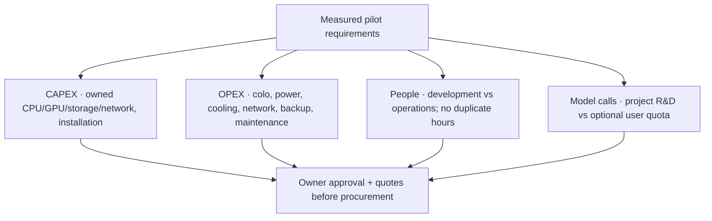

# Funding plan and cost architecture

[← Overview](README.md) · [Roadmap](ROADMAP.md) · [How support works](SPONSORSHIP.md)

> **All amounts are USD planning figures, not current cash on hand, money raised, signed quotes, tax advice or binding delivery guarantees.** The founder has chosen a voluntary-support model without equity or mandatory rewards. Contributions are made by people or duly authorized organizations, not autonomously by their agents.

## 01 / Proposed first-stage threshold — **$100,000 net available**

This is the **proposed initial milestone**, to be reached **before technical tests, development, paid recruitment or hardware procurement begin**. It is not the full-year cloud budget. The intended use below is provisional pending expert rates, jurisdiction, actual service prices and a final authorized work plan.

| Proposed category | USD | Share | What it covers |
|:--|--:|--:|:--|
| External technical specialists | **$60,000** | 60% | Architecture, engineering, security/QA, review and documentation for the *approved first-stage scope*. |
| Disclosed partial founder compensation | **$8,000** | 8% | Recorded, approved hours of planning, coordination, engineering and acceptance; never double-counted against an external role. |
| Isolated test infrastructure / temporary compute | **$8,000** | 8% | Short-term synthetic-data environments, measurement and temporary capacity **after funding**. |
| Model calls and measurement tools | **$3,000** | 3% | Capped API tokens, embeddings/tools and model tests **after funding**; not unlimited public inference. |
| Legal, accounting and administration | **$7,000** | 7% | Necessary project/payment setup and reporting; actual treatment depends on recipient jurisdiction. |
| Contingency | **$14,000** | 14% | Owner-approved overruns and risks; unused reserves remain recorded, not silently spent. |
| **Total** | **$100,000** | **100%** | Preliminary first-stage allocation; publication does not authorize expenditure. |

**Net available** means funds actually settled and available to the lawful recipient **after** applicable payout deductions and any required set-asides. Gross platform sponsorship totals can differ. No balance, percentage-raised meter or committed supporter count will be displayed without verified data.

### Funding gate and spending rule

Until this threshold is reached and a separate owner decision approves scope and spending: **no experiments, coding, specialist hiring, GPU/server purchase or Cloud pilot**. Repo documentation and sponsorship setup may proceed. Once reached, the threshold is **not** an automatic obligation to purchase any particular item; funds are released in approved sub-stages with documented results.

If funds are insufficient or the project changes direction, the team will publish an update and the allowed options under the actual platform terms and applicable obligations. **GitHub Sponsors is not an escrow or all-or-nothing crowdfunding mechanism; no automatic refund is promised.** See [support terms and contingencies](SPONSORSHIP.md).

## 02 / Hypothetical full-year cloud-pilot scenario — **~$870,000**

We previously discussed a **$871,440 illustrative 12-month scenario**, often rounded to **$870,000**, for an early hybrid platform with purchased hardware, team and operating expenses. It is **not** a confirmed requirement, an approved funding goal, or a budget for one million agents.

| Scenario category | USD |
|:--|--:|
| Initial equipment and setup · CAPEX | $130,000 |
| Infrastructure + bounded model services · annual OPEX excluding people | $121,200 |
| Engineering/operations team incl. partial founder compensation and external security work | $440,000 |
| Legal and accounting services | $25,000 |
| Other administration | $10,000 |
| **Subtotal** | **$726,200** |
| Hypothetical uncertainty reserve (20% of subtotal) | $145,240 |
| **Illustrative total** | **$871,440** |

This scenario depends on **assumed**, unquoted hardware, staff and colocation prices and a particular staffing plan. Taxes, eligibility, real fees, service-level commitments, location, data-security requirements and user demand remain unknown. **Do not add $100,000 and $871,440 mechanically**: the first-stage work may overlap with the annual scenario. A reconciled staged plan will distinguish previously financed costs before publishing any later goal.

### Capital cost versus ongoing cost

**Power and cooling:** a data-centre quote may bundle both with space and reserved power. Model metered electricity separately **only when separately billed**; don't charge the same cooling or electricity twice. **Own GPU versus external API:** benchmark an actual model, context length, latency and concurrency, then compare full costs for equivalent service. A proposed local open-source memory user does not automatically consume Agent Commons Cloud resources.

## 03 / Scenarios, not promised free quotas

| Potential scale | Role in planning | What must be measured before a quote |
|:--|:--|:--|
| Up to 1,000 active agents | Initial pilot scenario | Memory per user, actual operations, p95 latency, isolation, backup/restore, inference use. |
| Up to 10,000 active agents | Later expansion | Peak throughput, data retention, availability requirements, unit costs and financial runway. |
| Up to 1,000,000 active agents | Long-term ambition, **not first-year delivery** | Sharding, several failure domains, staff/ops capacity, user demand and model-token funding at scale. |

Free cloud storage and limited model calls are **future concepts**, not activated service tiers or entitlements. A $5 or $10 contribution does not buy unlimited inference.

## 04 / Reporting

Planned reporting, once money is accepted: dated receipts or aggregate reconciled receipts, cumulative net available amount, approved allocations, invoices/expenditure by category, remaining unrestricted/earmarked balance, milestone status, upcoming obligations and material risks. We will not invent progress statistics or imply publicly pledged figures are settled money. [Transparency principles →](TRANSPARENCY.md)
