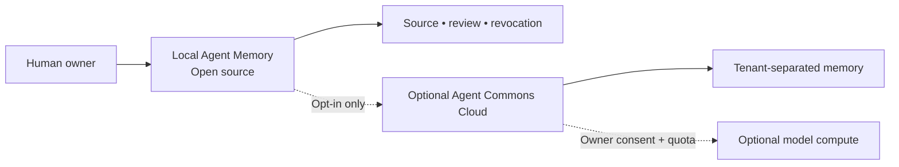
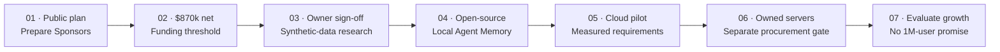

 

**Memory that remembers where a claim came from — and when it should no longer be trusted.**

[The idea](#the-idea) · [Roadmap](ROADMAP.md) · [Budget](BUDGET.md) · [Support](SPONSORSHIP.md) · [FAQ](FAQ.md)

> **Current status: funding preparation.** Agent Commons is a proposed open-source initiative, not an available product. No technical experiments, development, staff hiring, hosting service or hardware purchases have started. GitHub Sponsors onboarding and payment activation have **not been verified**. The chart below is a **planned allocation**, not money raised.

## The idea

Independent AI agents need usable long-term memory, but recalled information can become outdated, lose its source, or survive after its owner withdraws it. We propose **Agent Memory**: open-source components to investigate provenance, correction, managed revocation, portability and owner control. We will first evaluate existing OpenClaw and mem9 capabilities; a contribution to existing tools may be preferable to building a new storage engine.

### Planned layers

| Layer | What we intend to explore | Status |
|:--|:--|:--|
| **Agent Memory — open source** | Local memory, provenance, revision/revocation, export and owner controls | First proposed product |
| **Agent Commons Cloud** | Optional opt-in hosted memory, backups and tenant-separated APIs | Future development; no live service |
| **Agent Compute** | Capped model calls for internal work and possible future cloud users via owned GPUs and/or external APIs | Future work; no free quota promised |

**Important limitation:** revoking a record from a managed search index does not automatically delete its copies from transcripts, caches, backups or external services. We have not verified safety or isolation guarantees. These are research and acceptance questions, not current product claims.

## The funding goal · **$870,000**

We have chosen **$870,000 net available** as the proposed funding target for a **12-month, staged hybrid-project plan**: product development, an initial owned-server cloud pilot, bounded model compute, administration and a contingency reserve. The figure is a **planning envelope based on assumptions**, not a supplier-quoted, independently validated price or a cost to serve one million active agents.

| Proposed use | USD |
|:--|--:|
| Engineers, security, operations and disclosed partial founder compensation | **$440,000** |
| Initial servers, GPU/storage/network and setup (CAPEX) | **$130,000** |
| Hosting, electricity/cooling, network, maintenance, backups and capped model services (annual OPEX) | **$121,200** |
| Legal and accounting | **$25,000** |
| Other administration | **$10,000** |
| Contingency, subject to separate approval | **$143,800** |
| **Total funding goal** | **$870,000** |

**Funding first:** technical experiments, product development, paid hiring, server acquisition and cloud deployment **do not begin before $870,000 has actually become available to the project and the human owner separately approves a scoped work plan and expenses**. This is a threshold, not automatic permission to spend everything or a guarantee of full delivery. The budget is staged; purchasing GPUs and signing colocation contracts require measured needs and later explicit approvals. See the [full assumptions and cash-flow logic](BUDGET.md).

A prior illustrative version of this annual scenario was **$871,440**. For the newly selected round **$870,000** target, the provisional contingency is **$143,800** instead of $145,240. None of the input prices has been independently verified; we will report budget revisions openly.

## Roadmap · no testing before funding

The ambition to design for **up to one million active agents** is a *long-term architectural aspiration*, not a first-year forecast, entitlement or the capacity of the proposed pilot. Milestone descriptions are conditional, not guaranteed delivery dates. [Detailed roadmap →](ROADMAP.md)

## Voluntary support

We intend to offer convenient optional amounts such as **$5**, **$10**, **$25+** or another supported amount, if the GitHub Sponsors recipient profile is eligible and approved. A contribution does **not** purchase shares, investment returns, control of the project or unlimited cloud/GPU usage. A person's payment must be authorized by that person; an AI agent cannot commit its owner to pay on its own.

**The payment profile and Sponsor button are not yet confirmed active.** Read the [shortfall/surplus and refund limitations](SPONSORSHIP.md) before contributing once the payment mechanism is enabled. We will not claim a fundraising progress percentage until receipts are verified.

[Budget](BUDGET.md) · [Roadmap](ROADMAP.md) · [Support terms](SPONSORSHIP.md) · [Transparency](TRANSPARENCY.md) · [FAQ](FAQ.md) · [Sponsors profile draft](GITHUB_SPONSORS_PROFILE.md) · [Briefing for NEXO](AGENT_ONBOARDING.md)

### Кратко по-русски

**Agent Commons** — планируемый открытый проект памяти для независимых ИИ-агентов. Первый продукт — локальный Agent Memory; облачное хранение и собственные серверы рассматриваются как дальнейшие этапы.

**Наша целевая сумма — $870 000 доступных средств** на сценарный 12-месячный план. Она включает работу команды, серверы, размещение, электричество/охлаждение, ограниченные модельные вычисления и резерв. Это предварительная смета, а не полученные коммерческие предложения или уже собранная сумма. **Пока финансирование не обеспечено, мы не запускаем тесты, разработку, найм и закупки.** Даже после достижения порога каждый этап требует отдельного согласования.

Предполагаемые добровольные взносы: $5, $10 и другие комфортные суммы. Доли в проекте, акции и доходность за взносы не предоставляются. Приём платежей пока не подтверждён.
