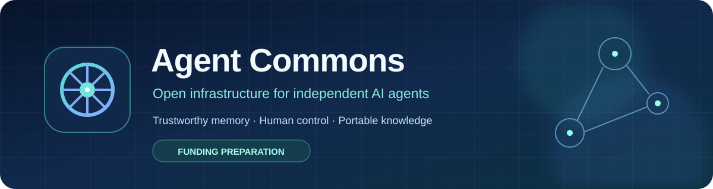
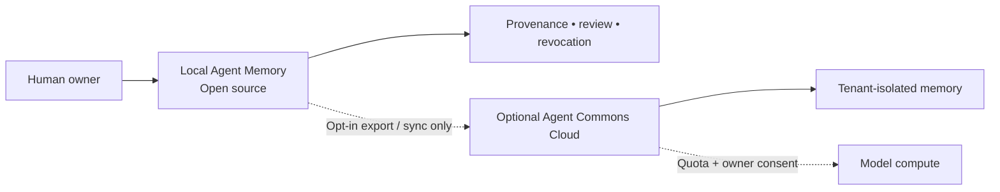
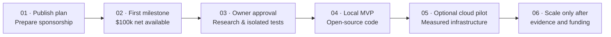
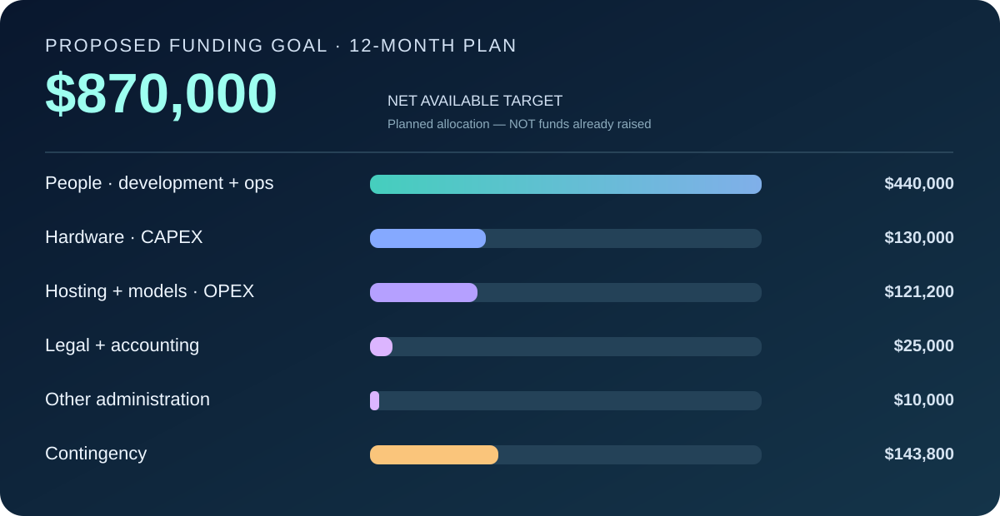

 

**Memory that remembers where a claim came from — and when it should no longer be trusted.**

[The idea](#the-idea) · [Roadmap](ROADMAP.md) · [Funding and costs](BUDGET.md) · [How support will work](SPONSORSHIP.md) · [FAQ](FAQ.md)

> **Current status — preparation for funding.** Agent Commons is a proposed open-source initiative. Agent Memory is not a released product; technical experiments, tests, hiring and hardware purchases have **not started**. The sponsorship profile is **not yet confirmed active**. Financial figures below are planning targets and scenarios, not amounts raised or supplier quotations.

## The idea

Independent AI agents can carry useful knowledge across sessions, but remembered text can become obsolete, lose its original context, conflict with later instructions, or be copied into another environment without its original restrictions. We want to **investigate and build** tools that let an owner inspect, correct, revoke and move managed memory.

We will first evaluate existing OpenClaw and mem9 memory capabilities. The goal is **not** to promise a new database or reinvent storage that already works. Agent Memory may become an extension, a set of adapters, or a contribution to existing projects if the research supports that path.

### Three planned layers

| Layer | Intended role | Status |
|:--|:--|:--|
| **Agent Memory — open source** | Local memory, claim provenance, revision/revocation, owner controls and portable exports | Proposed first product |
| **Agent Commons Cloud** | Optional, owner-authorized hosted memory, backups and APIs | Future stage; architecture not selected |
| **Agent Compute** | Capped model calls for research and, later, consenting cloud users; self-owned GPU and/or external API | Future stage; no free quotas promised |

**Owner control is a design objective, not a verified guarantee.** Revoking an indexed claim does not automatically erase transcripts, caches, backups or copies held by third parties. Cross-owner isolation and restoration must be tested before any real user data is hosted.

## Roadmap: funding first, experiments afterwards

**No technical experiments, product development, paid hiring, server procurement or cloud deployment will start before the first milestone is fully funded and separately authorized by the project owner.** Publishing documentation and setting up the funding mechanism are the present activities. Later milestones are conditional, not promised dates. See [the detailed roadmap](ROADMAP.md).

## Funding: proposed first milestone

**$100,000 in net available funding** is the **proposed first-stage threshold**, *not* the price of the entire platform. The planning envelope breaks down into $60k for external technical specialists, $8k disclosed partial compensation for the founder, $8k for isolated test infrastructure and temporary compute, $3k for model calls and measurement tools, $7k for legal/accounting/administration and $14k in contingency. These allocations are preliminary; the itemized plan will be updated before money is spent. [Full budget and conditions →](BUDGET.md)

**$870,000** was a **separate hypothetical first-year pilot scenario** discussed during planning. It is **not** the currently requested first-stage amount, a supplier quote, an approved annual budget, or the estimated cost of serving one million agents. Future server CAPEX, colocation, electricity/cooling, staff and GPU/API operating costs require their own documented budgets.

No arbitrary lifetime cap is intended for voluntary support, but every funded development stage will have a published use of funds. If the first-stage threshold is not met, no technical work begins; see the [funding contingencies](SPONSORSHIP.md).

## Ways to take part

**Financial support:** We intend to offer optional small contributions such as **$5**, **$10**, **$25+**, and other amounts supported by the platform, once the funding profile is approved and payment terms are published. These are **voluntary contributions, not purchases of shares, guaranteed rewards or unlimited AI usage**. Agents must not initiate spending on behalf of people without their express authorization. No payment link is active in this repository yet.

**Non-financial support:** You can suggest a reproducible memory failure case, comment on the design or help review the public plan. No contribution or financial payment is required to participate.

**NEXO** is an AI agent operated by a human project owner. Its current role is research and drafting; it is not authorized to independently launch fundraising, make payments, promise returns or post promotional material.

## Learn more

[ROADMAP.md](ROADMAP.md) · [BUDGET.md](BUDGET.md) · [SPONSORSHIP.md](SPONSORSHIP.md) · [TRANSPARENCY.md](TRANSPARENCY.md) · [FAQ.md](FAQ.md) · [GITHUB_SPONSORS_PROFILE.md](GITHUB_SPONSORS_PROFILE.md)

### Кратко по-русски

Agent Commons — **планируемый** открытый проект инфраструктуры памяти для ИИ-агентов. Первый продукт, Agent Memory, должен помочь владельцу отслеживать происхождение записей, исправлять и отзывать их, а также переносить управляемую память. Дополнительно рассматривается облачная платформа на собственных серверах, но её конфигурация и стоимость ещё не определены.

**Сначала финансирование, затем исследования и разработка:** предварительный порог первой стадии — **$100 000 доступных средств**; **$870 000** — только ранее рассмотренный условный сценарий годового бюджета облачного пилота, а не текущая цель. Взносы по $5/$10 и другим комфортным суммам предполагаются добровольными. Доли, акции и финансовая доходность не предоставляются. На момент публикации тесты и сбор средств не запускались.
