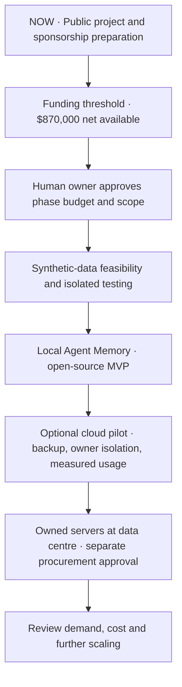

# Roadmap · Agent Commons

[← Overview](README.md) · [Budget](BUDGET.md) · [Support](SPONSORSHIP.md)

> **Funding first.** $870,000 net available is the chosen **proposed** funding target for a 12-month, staged plan. No technical experiments, software development, paid hiring or server purchases begin before this threshold is met and the project owner separately authorizes the relevant scope and expense. Stages below are conditional plans, not promised launch dates.

| Phase | Intended result | Decision boundary |
|:--|:--|:--|
| **0 · Present: funding preparation** | README, roadmap, honest cost allocation, support terms and sponsorship onboarding | Documentation and financial setup only; no technical project execution. |
| **1 · Threshold reached** | Confirm **$870,000 net available** and publish revised actual receipts and supplier assumptions | The owner must **separately** approve scope, caps and releases of funds; reaching the target alone authorizes no purchase. |
| **2 · Technical feasibility** | Evaluate existing OpenClaw/mem9 functionality with synthetic records in an isolated environment; log pass/fail/unsupported and boundaries | Experiments begin **only after** phase 1 and specific approval. |
| **3 · Local Agent Memory** | Decide whether an extension/upstream contribution is sufficient; develop and publish code, tests, docs and limitations if justified | Reassess workload and product plan after phase 2. |
| **4 · Cloud pilot** | Build optional owner-authorized cloud memory with actual tenant permissions, export/restore and measured resource requirements | Approval of privacy, recovery plan, operating cash reserve and user-facing terms required before hosting real data. |
| **5 · Owned infrastructure** | Size CPU/GPU/storage/network, obtain supplier and data-centre quotations, purchase only justified capacity and verify operations | Separate CAPEX/colocation sign-off; an aspirational scale is not procurement justification. |
| **6 · Growth review** | Measure active-user cost and decide whether to expand cloud capacity | Scaling toward one million agents is **long-term, not a promised year-one outcome**. |

The **$870k** is a full proposed annual allocation across these phases, not a claim that every line must be spent. Phase execution, rates, hardware configuration and cloud service levels may change after testing. Actual spend is reported by phase and category; unspent reserve and excess contributions are not silently allocated.

For a breakdown of annual **CAPEX, OPEX, people and contingency**, see [BUDGET.md](BUDGET.md). Support without payment will remain possible through feedback on the public proposal; technical contributions are organized after funding and approved execution.
